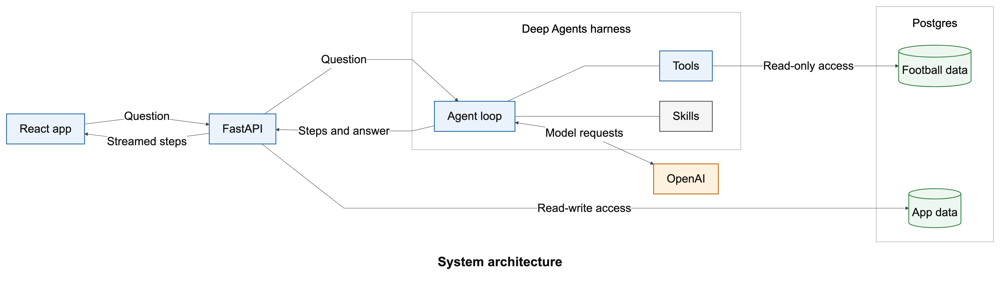
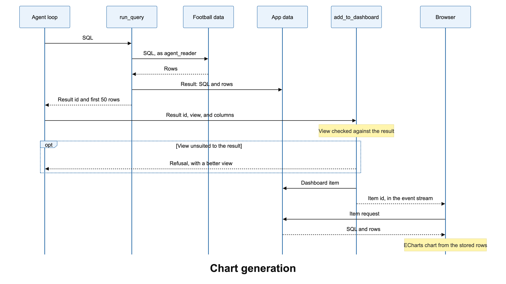

# Diagrams

Each diagram has a Mermaid source (`.mmd`) and two renders of it (`.png` and `.svg`). The comments
at the top of each source file describe what the diagram leaves out.

## System architecture

[`architecture.png`](architecture.png) shows the parts of the app and what passes between them.



- The React app sends a question to FastAPI, and FastAPI streams the agent's steps back on the
  same HTTP response as server-sent events.
- FastAPI hands the question to the Deep Agents harness. The harness holds the agent loop, the
  two tools, and the three skills, and returns every message it produces.
- The agent loop sends model requests to OpenAI. This is the only outside service.
- The tools reach the football data as `agent_reader`, a role with SELECT and nothing else.
- FastAPI reads and writes the app data: sessions, query results, dashboard items, costs, and the
  agent's conversation memory.

The code for each part is listed in the
[repository map](../README.md#a-map-of-the-repository).

## Chart generation

[`chart_generation.png`](chart_generation.png) follows one chart from the agent's SQL to the
browser.



1. The agent loop sends SQL to `run_query`, which runs it on the football data as `agent_reader`.
2. `run_query` saves the result, with its SQL and rows, in the app data. The model gets the
   result id and the first 50 rows.
3. The agent calls `add_to_dashboard` with the result id, a view, and the columns. It never sends
   the numbers.
4. `add_to_dashboard` checks the view against the result. If they do not fit, it refuses and says
   what to change, and the agent tries again.
5. The dashboard item is saved, and its id reaches the browser in the event stream.
6. The browser fetches the item's SQL and rows, and ECharts draws the chart from them.

FastAPI sits between the browser and the app data in steps 5 and 6. The diagram leaves it out to
stay small.

## Rendering

After editing a `.mmd` file, render it again with the Mermaid CLI, from this folder:

```bash
npx -y @mermaid-js/mermaid-cli -i architecture.mmd -o architecture.png -s 2 -b white
```

Use `-o architecture.svg` for the SVG, and the same commands for `chart_generation.mmd`. You can
also paste a source into the [Mermaid Live Editor](https://mermaid.live) to see it change as you
type.
